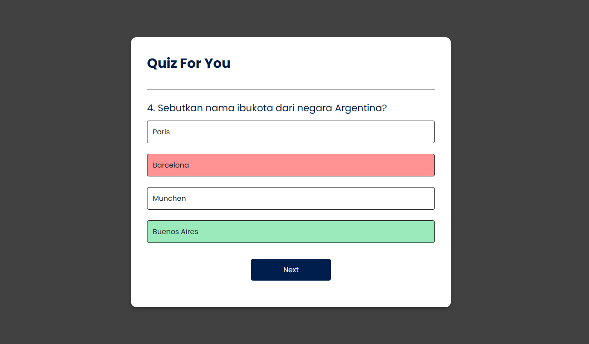

# Quiz For You
A simple quiz web application where users can test their knowledge on various topics.

## Introduction
"Quiz For You" is a web application that presents users with a series of questions on different topics. Users can choose the correct answer from the options provided, and the app will track their score. It's a fun way to test and enhance your knowledge!

## Features
- Multiple-choice questions on various topics.
- Interactive buttons for selecting answers.
- Immediate feedback on correct and incorrect answers.
- Score tracking and display at the end of the quiz.
- Play again option to restart the quiz. 

## Getting Started
To get started with the Quiz For You app, simply clone the repository to your local machine.

## Usage
- Open the index.html file in your preferred web browser.
- Answer the questions by clicking on the provided options.
- Receive immediate feedback on correct and incorrect answers.
- See your final score at the end of the quiz.
- Optionally, click the "Play Again" button to restart the quiz.

## image

Feel free to customize the README according to your specific project details and preferences.